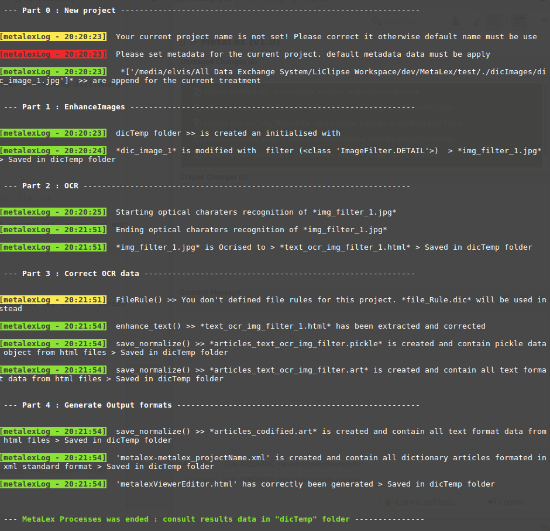

MetaLex Tool (tool for lexicographers and metalexicographers)
===============================================================

**metalex** is general tool in AGPL Licence for **lexicographics** and **metalexicographics** activities.
For current developpement version of this tool, see `MetaLex/v1.0 <https://github.com/Levis0045/MetaLex/tree/v1.0>`_

Usage
=====

- metalex proceeds in this way (written in french)

.. image:: ./docs/metalex_process.png

- This is an example of this process used with metalex 

::

    I am a metalexicographer or linguist and I have paper dictionaries. 
    I want to perform a diachronic study of the evolution of the wording of 
    definitions in a collection of dictionaries available from period A to period B.

- Traditionally or at best, the contemporary metalexicographer (according to our point of view) would apply the following methodology :
 
::

    1- Scanning of printed materials (Scan) and enhance its qualities
    2- Optical reading of the pictures (Ocrisation) = extract articles content 
    3- Manual Error Corrections  of text articles                   
    4- Marking of the articles with regular standard                 
    5- Metalexographical analysis / decryption of articles 

- metalex through its modules operates in the same way by successively executing  each of these tasks automatically.

::

    1)  MetaLex enhances the quality of dictionary images 
        **metalex.ocrtext.normalizeImage.EnhanceImages().filter(f.DETAIL)**
    2) MetaLex extract from dictionary images all dictionary articles 
        **metalex.ocrtext.make_ocr.image_to_text()**
    3) MetaLex corrects dictionary articles 
        **metalex.ocrtext.make_text_well()**
    4) MetaLex marking dictionary articles depending of some standard 
        **metalex.xmlised.put_xml('tei') or MetaLex.xmlised.put_xml('lmf')**
    5) MetaLex generates some metalexicographics analysis of part of content dictionary 
        **metalex.xmlised.handleStat()**

- Some other more complex processes can be done !

Requirements
============

MetaLex is developped in **Python 2.7** environment, the following packages are required :

- We can install all package dependencies manually

::

    sudo apt-get install build-essential libssl-dev libffi-dev python-dev
    sudo pip install Cython
    sudo apt-get install libtesseract-dev libleptonica-dev libjpeg-dev zlib1g-dev libpng-dev
    sudo apt-get install tesseract-ocr-all
    sudo apt-get install python-html5lib
    sudo apt-get install python-lxml
    sudo apt-get install python-bs4
    sudo pip install pillow
    sudo pip install --no-cache-dir -I pillow
    sudo pip install http://effbot.org/downloads/Imaging-1.1.7.tar.gz
    sudo pip install termcolor
    sudo CPPFLAGS=-I/usr/local/include pip install tesserocr

- Or follow these steps 

::

    sudo ./config.sh     # Install linux package dependencies
    
    sudo pip install -r requirements.txt  # Install python module dependencies

How to run MetaLex ?
====================

- Go to the **test/** folder and run build help command

::

    python runMetalex.py -h

::

       metalex arguments :
    
      -h, --help            show this help message and exit
      -v, --version         show program's version number and exit
      -p PROJECTNAME, --project PROJECTNAME
                            Defined metalex project name
      -c author comment contributors, --confproject author comment contributors
                            Defined metalex configuration for the current project
      -i [IMAGEFILE], --dicimage [IMAGEFILE]
                            Input one or multiple dictionary image(s) file(s) for
                            current metalex project
      -d IMAGESDIR, --imagedir IMAGESDIR
                            Input folder name of dictionary image files for
                            current metalex project
      --imgalg actiontype value
                            Set algorithm for enhancing dictionary image files for
                            current metalex project (actiontype must be : constrat
                            or bright or filter)
      -r FILERULE, --filerule FILERULE
                            Defined file rules that we use to enhance quality of
                            OCR result
      -l LANG, --lang LANG  Set language for optical characters recognition and
                            others metalex treatment
      -x {xml,lmf,tei} {xml,lmf,tei} {xml,lmf,tei}, --xml {xml,lmf,tei} {xml,lmf,tei} {xml,lmf,tei}
                            Defined output result treatment of metalex
      -s, --save            Save output result of the current project in files
      -t, --terminal        Show result of the current treatment in the terminal

- Build the file rules of the project.

MetaLex takes files using specific structure to enhance output text of OCR data (from dictionary image files). **\\W** for word replacement, **\\C** for character replacement and **\\R**  for regular expression replacement. The spaces between headers are used to to describe remplacement.

::

    \START
    \MetaLex\project_name\type_of_project\lang\author\date
    \W
    /t'/t
    /{/f.
    /E./f.
    \C
    /i'/i
    \R
    /a-z+/ij
    \END
    

- Run your project with the default parameters except dictionary images data and save results. You must create a folder containing dictionary image files such as **imagesInput/**.

::

    python runMetalex.py  -d 'dicImages' -s  # We defined a folder containing dictionary images for current process
    python runMetalex.py  -i 'dicImages/dic_image_1.jpg' -s  # Or you can define a single dictionary image file

- Run your project with your own set of parameters and save results

::

    python runMetalex.py -p 'projectname' -c 'author' 'comment' 'contributors' -d 'imagesInput' -r 'file_Rule.dic' -l 'fra' -s

- **OUTPUT :** For the first comand (without parameters), the result in the console will produce this. **NB :** With parameters, error and warning messages will disapear.

 

Contributors
============

Special thank to  `Bill <https://github.com/billmetangmo>`_  for `MetaLex-vagrant <https://github.com/Levis0045/MetaLex-vagrant>`_ version for windows, Mac OS 6, Linux

Reference
=========

Please don't forget to cite this work :

::

    @article{Mboning-Elvis,
        title  = {Quand le TAL s'empare de la métalexicographie : conception d'un outil pour le métalexicographe},
        author = {Mboning, Elvis},
        url    = {https://github.com/Levis0045/MetaLex},
        date   = {2017-06-20},
        shool  = {Université de Lille 3},
        year   = {2017},
        pages  = {12},
        keywords = {métalexicographie, TAL, fouille de données, extraction d'information, lecture optique, lexicographie, Xmlisation, DTD}
    }

